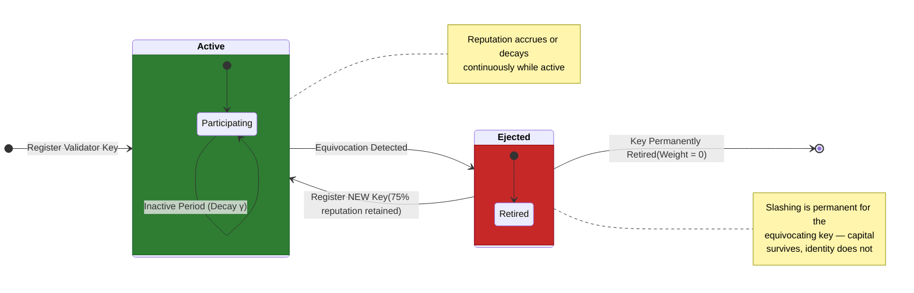
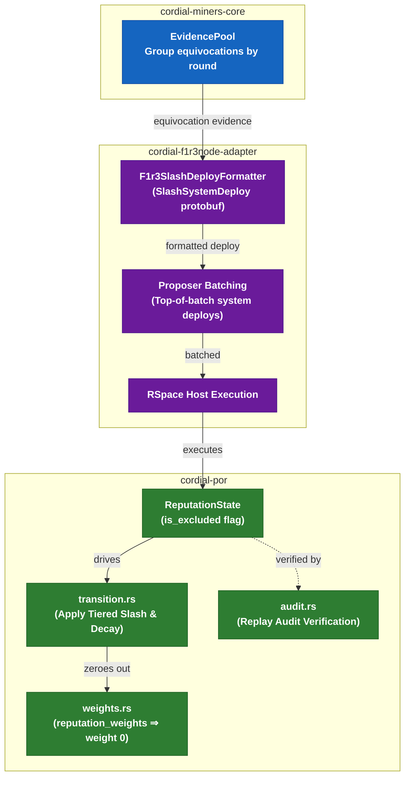

# Cordial PoR Tiered Slashing & Permanent Key Ejection Specification

## Document Context

- **Document ID**: `crates/cordial-por/docs/01-tiered-slashing-and-key-ejection.md`
- **Status**: Approved Architecture Specification
- **Related Specs**:
  - [`00-architecture.md`](file:///home/bini/Documents/repos/cordial-f1r3node/crates/cordial-por/docs/00-architecture.md)
  - [`data-structures.md`](file:///home/bini/Documents/repos/cordial-f1r3node/crates/cordial-por/docs/data-structures.md)
  - [`docs/cordial-miners/16-slashing-integration.md`](file:///home/bini/Documents/repos/cordial-f1r3node/docs/cordial-miners/16-slashing-integration.md)

---

## 1. Overview & Motivation

### Problem Statement

The initial Cordial consensus slashing implementation applies an immediate 100% binary zero-reputation slash upon detecting any equivocation. While economically secure against malicious double-signing, this model is brittle:

- A minor software bug, failover configuration error, or network partition causing a single honest node operator to double-sign results in total capital wipeout.
- If multiple honest nodes experience the same client bug concurrently, the network risks losing its consensus supermajority ($>66.7\%$ active weight), causing a catastrophic liveness halt.

### Ethereum PoS Foundations

This specification transitions `cordial-por` from binary slashing to a **Tiered Correlation Slashing with Permanent Key Ejection** model **directly based on Ethereum Proof-of-Stake (PoS)** (Casper FFG / LMD-GHOST anti-correlation mechanism):

- **Anti-Correlation Scaling**: In Ethereum PoS, slashing penalties scale based on how many validators equivocate within a sliding window. An isolated double-sign incurs a minor initial penalty (~1 ETH out of 32 ETH), while correlated equivocations involving a large fraction of the validator set scale up to a 100% penalty (full 32 ETH burn).
- **Permanent Ejection + Fresh Key Re-Registration**: Slashed Ethereum validators are permanently exited and barred from re-entering under the same key. However, the operator retains their un-slashed capital (75% for an isolated fault) and can register a fresh validator key.
- **Inactivity Leak**: Offline nodes undergo slow fixed-point decay ($\gamma$) without key ejection, preserving liveness without sudden state locks.

---

## 2. Slashing & Penalty Model

### Metric Matrix

| Metric | Legacy Binary Model | Proposed Model (Ethereum PoS-based) |
| :--- | :--- | :--- |
| **Initial Equivocation Penalty** | 100% loss | **25% immediate reputation/stake reduction** |
| **Network Correlation Scaling** | None | **If $>30\%$ of active weight equivocates in round $k$, penalty scales to 100%** |
| **Validator Key Status** | Immediate zero-reputation | **Permanent key ejection (`is_excluded = true`)** |
| **Operator Recovery Path** | None (Destroyed) | **Re-register fresh validator key with remaining 75% capital** |
| **Downtime / Liveness Policy** | Undefined | **Inactivity leak (fixed-point reputation decay $\gamma$)** |

### Anti-Correlation Formula

For round $k$, let $W_{\text{equivocating}}$ be the total active reputation weight of nodes equivocating in round $k$, and $W_{\text{total}}$ be the total active network reputation weight:

$$\text{CorrelatedRatio}(k) = \frac{W_{\text{equivocating}}}{W_{\text{total}}}$$

The slash penalty ratio $\text{PenaltyRatio}(k)$ applied to all equivocating nodes in round $k$ can be evaluated using either a step function or a continuous linear scale:

#### Primary Step Function Model

$$\text{PenaltyRatio}(k) = \begin{cases} 0.25 & \text{if } \text{CorrelatedRatio}(k) \le 0.30 \\ 1.00 & \text{if } \text{CorrelatedRatio}(k) > 0.30 \end{cases}$$

#### Post-Slash Reputation Update Formula

For each equivocating node $i$:

$$\text{Reputation}_{\text{new}, i} = \text{Reputation}_{\text{old}, i} \times \left(1 - \text{PenaltyRatio}(k)\right)$$

---

• If CorrelatedRatio (k) ≤ 30% (Isolated Fault): Node retains 75% of its reputation/capital and can register a new key.
• If CorrelatedRatio (k) > 30% (Coordinated Attack): Node retains 0% (complete wipeout).
• Key Ejection: Regardless of the ratio, the validator key is marked is_excluded = true and exports weight 0.

---

## 3. Validator Key Lifecycle & State Machine

### Lifecycle Rules

1. **Active State**: Node participates in consensus, receives ratings, and exports weight $W = \text{ReputationValue}$.
2. **Equivocation Event**:
   - `ReputationState` calculates $\text{PenaltyRatio}(k)$.
   - $\text{ReputationValue}_{\text{new}} = \text{ReputationValue}_{\text{old}} \times (1 - \text{PenaltyRatio}(k))$.
   - Node status is marked as `is_excluded = true`.
3. **Ejection & Weight Export**:
   - `reputation_weights()` in `cordial-por` maps `is_excluded` nodes to weight `0` (or omits them from the active validator set).
   - Ejected keys are permanently barred from consensus proposing or voting.
4. **Key Rotation & Re-registration**:
   - The operator retains $\text{ReputationValue}_{\text{new}}$ (75% for isolated faults).
   - To resume validation, the operator generates a new cryptographic public key (`NodeId_new`) and submits a key registration deploy transferring the remaining balance/reputation to `NodeId_new`.

---

## 4. Architectural Boundaries & Crate Responsibilities

The implementation enforces strict separation of concerns across workspace crates:

### 1. `cordial-por` (Pure Math & State Container)
- **`src/types.rs`**: Adds `is_excluded: bool` to `ReputationEntry` and `ReputationState`.
- **`src/transition.rs`**: Applies fixed-point $\text{PenaltyRatio}$ reduction and inactivity decay factor $\gamma$.
- **`src/weights.rs`**: Exports `0` weight for `is_excluded` validator nodes.
- **`src/audit.rs`**: Verifies proposed `ReputationBlock` instances against the tiered transition replay.

### 2. `cordial-miners-core` (Evidence Collection)
- Retains generic `EquivocationEvidence`.
- Aggregates equivocating validator IDs by round $k$ to supply total equivocating weight calculations.

### 3. `cordial-f1r3node-adapter` (Host System Deploy Integration)
- **`src/slashing.rs`**: Formats tiered slash evidence into `SlashSystemDeployDataProto` system deploy bytes.
- **`src/proposer.rs`**: Places slash system deploys at the top of host execution batches in RSpace prior to user deploys.

---

## 5. Work Breakdown & Issues

| Issue ID | Scope / Crate | Title | Dependencies |
| :--- | :--- | :--- | :--- |
| **Issue #1** | `cordial-por` | Add Permanent Key Ejection State & `0`-Weight Export | None |
| **Issue #2** | `cordial-por` | Implement Tiered Slashing Math & Inactivity Decay in `transition.rs` | Issue #1 |
| **Issue #3** | `cordial-miners-core` | Round-Correlated Evidence Aggregation in `EvidencePool` | None |
| **Issue #4** | `cordial-f1r3node-adapter` | Slash System Deploy Formatter & Top-of-Batch Proposer Wiring | Issues #1, #3 |
| **Issue #5** | Integration Tests | End-to-End Tiered Slashing & Key Rotation Harness | Issues #2, #4 |

---

## 6. Verification & Test Plan

1. **Isolated Fault Test**:
   - Inject equivocation evidence for 1 validator node ($<30\%$ weight).
   - Verify node reputation drops by 25%.
   - Verify `reputation_weights()` exports weight `0` for the ejected node key.
   - Verify remaining 75% capital can be attached to a newly registered validator key.

2. **Coordinated Attack Test**:
   - Inject equivocation evidence for $>30\%$ of active validator weight in round $k$.
   - Verify all offending nodes suffer 100% reputation reduction.
   - Verify all offending keys are marked `is_excluded = true`.

3. **Audit Replay Conformance Test**:
   - Verify `verify_reputation_transition()` passes for blocks incorporating tiered slashes and rejects blocks with incorrect penalty math.
